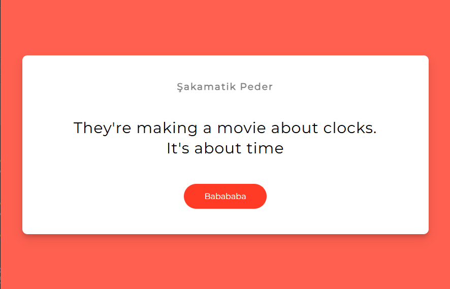
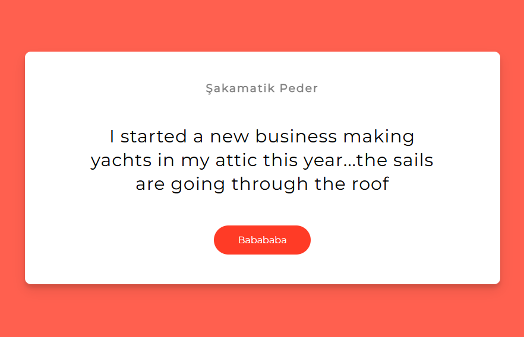

# 😂 Dad Jokes

A simple web app that fetches **random dad jokes** from a public API using the **Fetch API** and displays them on the page with a single click.

---

## 🎯 Features

- Fetches random dad jokes from an external API  
- Button click to get a new joke instantly  
- Loading state while the joke is being fetched

---

## 🎥 Preview

<p align="center">
  
  

</p>

---

## 🛠 Tech Stack

- **HTML**
- **CSS**
- **JavaScript (Fetch API)**

---

## 📦 Setup

```bash
# Clone the repository
git clone https://github.com/yigitkagankartal/dadJokes.git
